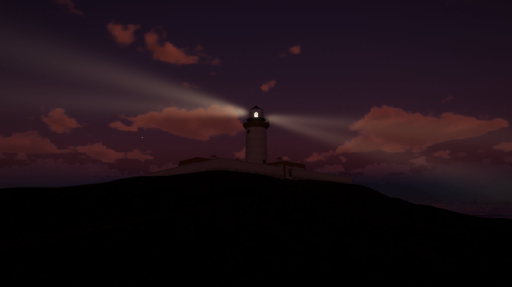

# Seven Hunters

**15 December 1900.** The new light on Eilean Mòr, in the Flannan Isles twenty miles west of Lewis, goes dark.
On Boxing Day the relief boat finds the station empty. Three keepers are never found.

**3 January 1901.** The Northern Lighthouse Board needs the light kept. You are put ashore with the stores, and the
swell turns the boat back before the other two men can land. Keep her lit.

Seven Hunters is a first-person game about one night keeping the light: a playable demo of a longer game in
the lineage of *Firewatch* (the plan is in [`docs/PLAN.md`](docs/PLAN.md)). It runs in the browser on WebGPU,
on its own small WGSL engine, and grew out of [Tidewater](#tidewater), an island fishing game on the same
engine, which is still in here.

**Play it:** https://thehillbeyondthisone.github.io/lighthouse/



## The night

About twenty to thirty minutes, from 13.40 on the landing stage to the journal after sunrise.

- Climb from the east landing to the station, find the keepers' room and the Board's letter.
- Light the lamp at sunset (15.09) and wind the machine that turns the lens: two white flashes every 30
  seconds, the light's real character. The machine runs down in three hours, and its bell warns you.
- Chalk the observations on the slate at six and at nine.
- After dark, a light on Gallan Head, 33 km east on Lewis: the Watcher. Read her Morse through the telescope
  and answer from the signal lamp on the walkway, with the Board's code (quick) or your own words spelled out
  (slow: the clock runs while you send). She can only be seen while the air is clear.
- Then the haar comes in from the west, and the beams go round in it.
- Write up the journal in the morning. What you saw, and what you leave out, is yours to decide.

The island is Eilean Mòr from the real elevation data, with Lewis, Harris and St Kilda across the sea (they
show only on clear days), the sun and the full moon of 3 January 1901 at 58°N, and the station as it stood:
the tower, the keepers' house, the landings, the tramways and St Flannan's chapel. The record of December 1900
is real; Walter Innes, Ceit Macleod and the Board's letter are fiction (`docs/PLAN.md` §2.7).

## Controls

| Key | Action |
|---|---|
| W A S D | Walk (Shift to hurry) |
| Mouse | Look (click to capture the mouse, Esc to release it) |
| E | Use: doors and the gate, the letter, the slate, the journal, the signal lamp. **Hold** E to light the lamp and to wind the machine |
| Right mouse | Look through the telescope (once you have it) |
| L | Hand lamp |
| Space | Read the Watcher's signals faster |
| M | Mute |
| H | Settings panel |
| P | Photo mode |
| F1 or ? | All controls |

The night is saved in the browser as you go; reloading offers to continue it.

## Requirements

- A browser with WebGPU: a recent Chrome, Edge or Safari.
- A capable GPU. Dynamic resolution scales the render down on slower machines.
- The first load compiles several hundred shaders, which can take a minute or more. Later visits are
  faster because the browser caches them.

## URL options

Add these to the URL, for example `?nostory&vis=90`:

| Option | Effect |
|---|---|
| `setting=tidewater` | Tidewater, the island fishing game |
| `nostory` | The Flannans without the story: walk the island freely |
| `lamp` | The lamp lit and turning from the start |
| `vis=<km>` | Visibility at sea level (with `nostory`; the story keeps its own weather) |
| `style=poster` | The Style Lab's looks: `poster`, `albumen`, `cyanotype` (docs/PLAN.md §4) |
| `fly` | Start in the free camera (F toggles it) |
| `noAudio` | Disable sound |
| `noClouds` | Skip the volumetric clouds |
| `noHaze` | Skip the haze, the sun shafts and the beams |

## Running locally

```sh
npm install
npm run dev      # http://127.0.0.1:5189
npm run build    # static build in dist/
npm test         # logic tests (and the GPU smoke test, which needs a WebGPU adapter)
```

`node test/demo-walk.mjs` walks the route from the landing stage up the tower to the walkway, and
`node test/demo-story.mjs` plays the whole night through, both without a GPU. `npm run shots` renders
screenshots of the real game without a browser or GPU (see `HISTORY.md`).

Every push to `main` deploys to GitHub Pages through `.github/workflows/deploy.yml`.

## Project layout

| Folder | Contents |
|---|---|
| `src/story/` | Seven Hunters' night: the story director, interactions, the Watcher and Morse, the script, the pages |
| `src/station/` | The light: the lamp, the clockwork and the lens's turn; the beams and far lights in the haze |
| `src/game/` | Tidewater's fishing game: rod, bites, the fight, catch card, cooler and log, vendors and stalls, guide, minimap, HUD |
| `src/engine/` | The rendering engine: math, scene graph and geometry, GPU resources, WGSL shader composition, materials, lighting and shadows |
| `src/ocean/` | FFT ocean, water surface and material, shore waves, breakers, swash, wake, caustics, underwater lighting |
| `src/sky/` | Atmosphere, clouds, sky and environment |
| `src/world/` | Terrain, village, pier, reef, fish, vegetation, rocks, debris, wildlife, whale, boat |
| `src/post/` | Post chain: AO, underwater composite, haze, TAAU, motion blur, bloom, lens flare, droplets |
| `src/materials/` | Shared lighting: shadow filtering, bounce light, contact shadows, local lights, LOD fades |
| `src/player/` | Walking, swimming, the boat and the free camera |
| `src/audio/` | The sample-based soundscape |
| `src/ui/` | Settings panel, loading screen and HUD |
| `tools/` | Scripts that fetch and convert the characters, stall props and fishing sounds |
| `test/` | Headless engine smoke test and game-logic tests (`npm test`), and HUD / loader dev pages |

## Tidewater

An island fishing game for the browser, by Daniel Greenheck: cast from the pier, the beach or your own boat,
fight the fish, sell your catch to Joe at the fish stand, and spend it on better gear at Marta's chandlery.
Around it is a real-time tropical island and ocean. Open it with `?setting=tidewater`; the original is at
https://dgreenheck.github.io/tidewater/.


### Features

**Fishing**
- A spinning rod and reel that cast, reel and bend under load, with the bail, rotor and crank animated.
- Bites that depend on the water (shallows, pier, reef, bay, deep water), depth and time of day, across
  18 Caribbean species.
- A line-tension fight: keep the tension in the green band, ease off when the fish runs.
- A full-screen catch card with the fish's length and weight, a fish log with records, and a cooler.
- Joe's fish stand buys your catch; Marta's chandlery sells line, reels, rods, a bigger hold, fuel, a rebuilt
  engine, a fish finder and deck floodlights for night fishing.
- Walk the deck and the wheelhouse while the boat drifts; the boat burns fuel.
- A first-play guide, contextual tips and a minimap. Progress is saved in the browser.

**Ocean**
- Four-cascade FFT ocean (Tessendorf spectra) with foam, whitecaps, wind streaks and swell.
- Depth-aware breaking waves with peeling shoulders, whitewater, spray and foam lace.
- A shallow-water simulation for swash running up and down the sand.
- Boat wake and bow spray, and a whale wake.
- Caustics on the seabed and in the water, with light shafts.
- A split underwater/above-water view at the waterline, with water droplets on the lens after surfacing.
- Refraction of the seabed through the surface, including behind the pier and boats.

**Sky**
- Physically based atmosphere (Hillaire 2020) with a sun, moon and stars.
- Volumetric cumulus and wispy cirrus with cloud shadows on the land.
- Aerial perspective and sea haze.
- God rays, and a lens flare with occlusion.

**World**
- An island with a beach, hills, headlands and rocks.
- A fishing village, a pier, and the vendors' stalls built from Poly Haven scans.
- Realistic vendor characters (Microsoft Rocketbox) with skinned animation.
- A coral reef with fish.
- Palms, bananas, monstera, elephant ear, heliconia, bird of paradise, broadleaf trees, shrubs and dune
  grass, with impostors and dithered LOD fades.
- Beach debris.
- Birds, crabs and marine snow.
- A humpback whale with an escort of fish, blows, fluke dives and breaches.

**Lighting and post**
- Cascaded shadows with contact-hardening penumbrae, and screen-space contact shadows.
- Ground bounce light.
- GTAO ambient occlusion.
- Temporal upscaling and sharpening.
- Bloom, auto exposure and motion blur.
- Night lighting from lanterns, windows and the boat, plus a flashlight that also works underwater.

**Audio**
- Positional audio from real CC0 field recordings: surf timed to each breaking wave, wind, birds, the boat
  engine, footsteps by surface, underwater ambience, whale song, and the rod and reel (casts, the bail,
  reeling, the drag, line snaps, splashes).

### Tidewater controls

| Key | Action |
|---|---|
| W A S D | Move |
| Mouse | Look (click to capture the mouse, Esc to release) |
| Shift | Sprint / boat boost |
| Space | Jump / swim up |
| C | Crouch / dive |
| E | Interact: board the boat, take or leave the helm, step ashore, trade with the fish buyer or the chandlery |
| V | Boat camera at the helm (1st / 3rd person) |
| R | Take out / put away the fishing rod |
| Left mouse | Hold to wind up, release to cast · strike when a fish takes the bait · hold to reel |
| Right mouse | Reel an empty line in |
| I or Tab | Cooler / fish hold and the fish log |
| F | Free camera |
| L | Flashlight |
| T | Pause time |
| M | Mute |
| H | Settings panel |
| P | Photo mode |
| F1 or ? | All controls |

#### Fishing

Walk the deck of the boat while it drifts, or fish from the pier and the beach. Cast, wait for the bobber
to dip and strike when it's pulled under, then play the fish: keep the line tension in the green band,
ease off when it runs. Different water holds different fish (the shallows, the pier, the reef, the bay and
deep water offshore), and some bite best at dawn, dusk or night. Sell your catch to Joe at the fish stand
on the beach by the pier, and spend it at Marta's chandlery by the boathouse: stronger line, a faster reel,
a longer rod, a bigger fish hold, a larger fuel tank, a rebuilt engine, a fish finder and deck floodlights for
night fishing. The boat burns diesel at the helm; fill up at the chandlery. Progress is saved in the browser.

The settings panel (H) exposes the sea state, time of day, sun azimuth, clouds, haze, post-processing and
more.

## Credits and license

The code is released under the MIT license; see [LICENSE](LICENSE). Third-party assets (CC0 audio from
Freesound, CC0 scans from Poly Haven, MIT characters from Microsoft Rocketbox, OFL / Apache fonts) and
technique references are listed in [CREDITS.md](CREDITS.md).
